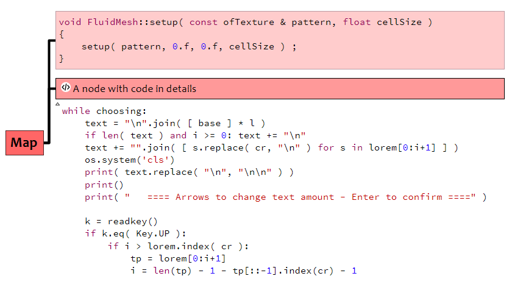

# Format programming code

When I paste code samples in Freeplane, I use these scripts to format them : style and syntax highlighting.

# Installation

These scripts use the [highlight software](http://www.andre-simon.de/doku/highlight/en/highlight.php) to format the code.  
The software must be installed, and the variable `highlightPath` in `FormatCode.groovy` must contain the executable path.

- Put `FormatCode.groovy` in `freeplane_user_dir/lib` directory.
- Put the other scripts `freeplane_user_dir/scripts` directory.
- Start or restart Freeplane

# Customization

Read the comments in `FormatCode.groovy`, and modify it.
