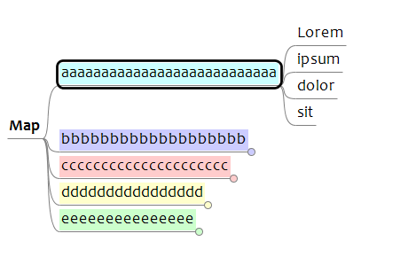
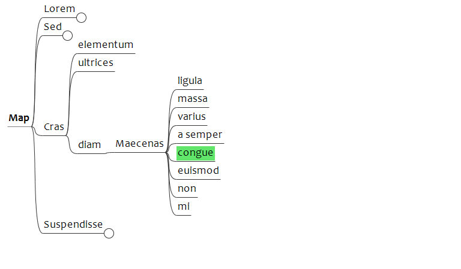
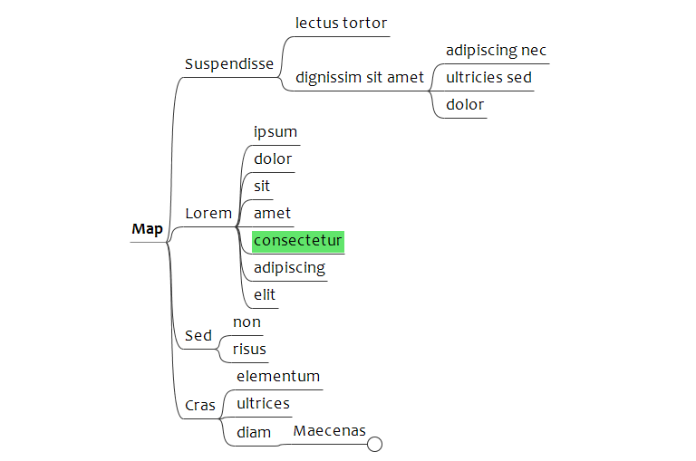
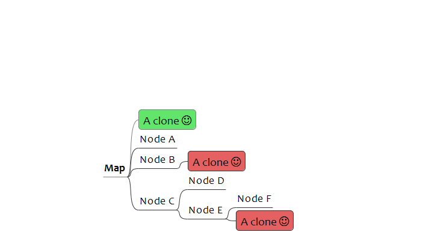
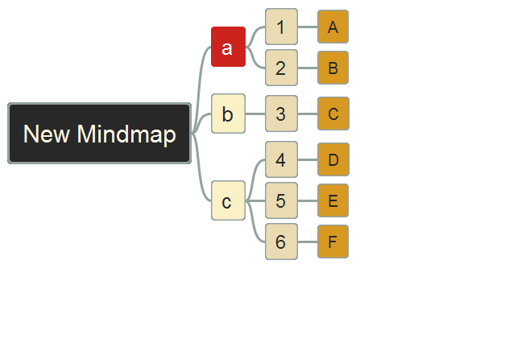
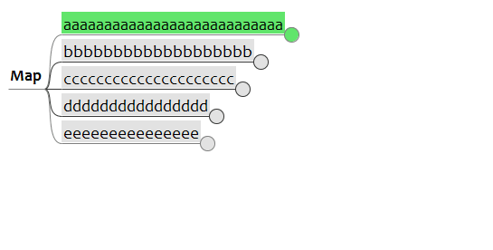
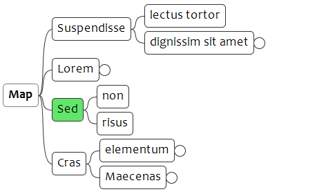
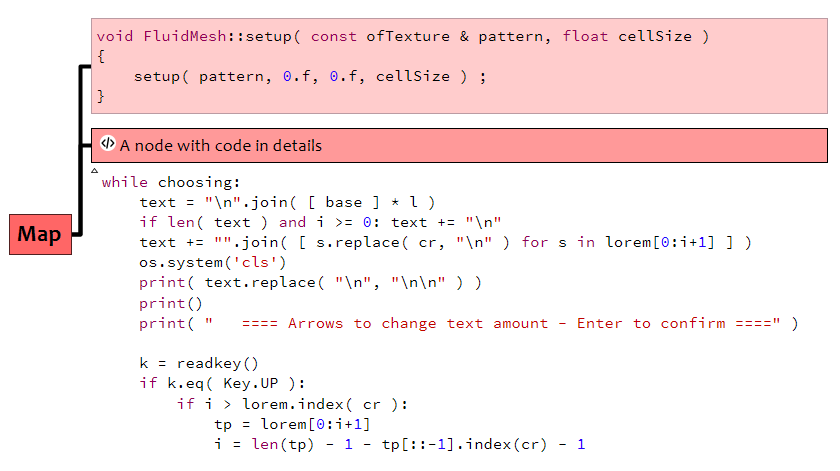

# Disclaimer

Hi,

These are some scripts I use, or I used. Try them at your own risk !

# Folders overview

- [Archives](Archives): Old scripts
- [Bookmark maps](Bookmark%20maps): Memorize maps
- [Filter](Filter): Filter scripts
- [Format](Format): Formatting scripts
- [Mark](Mark): Mark one node and do stuffs with it
- [Navigation](Navigation): Move within the map
- [Progress icons](Progress%20icons): Change progress icons
- [Tags](Tags): Tags scripts
- [Tests](Tests)
- [View](View): Display scripts

# Scripts I currently use

## Navigation

- BrowseUp and BrowseDown

Fold the node, jump to one sibling, and unfold this sibling at the same level:

- GotoParentFolded

Fold the node, or go to its parent.  
I use it in combination with the 2 previous one.

- MinimizeMap

Same as menu Navigate > Goto root then Navigate > Fold > Fold all

- JumpToNextClone

- SelectSiblings, SelectChildren, SelectParents

Usefull to apply the same format to columns of nodes

## Format

- DecreaseNodeWidth and IncreaseNodeWidth

- ToggleBlockViewForAllSiblings

- Format code

## Others

- CreateFileNodeFromClipboardPath

I use a keyboard shortcut to copy a file path within my file explorer, then this script to create the corresponding node.  
Same result than to drag a file into a map.

- LinkToPdfPage
